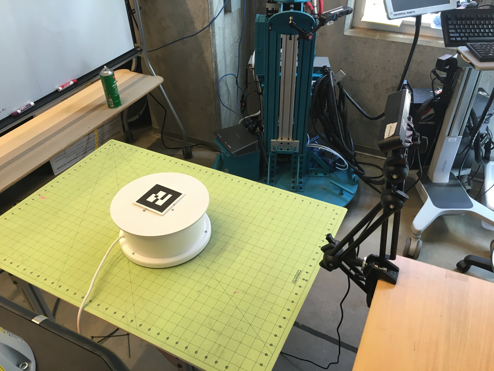
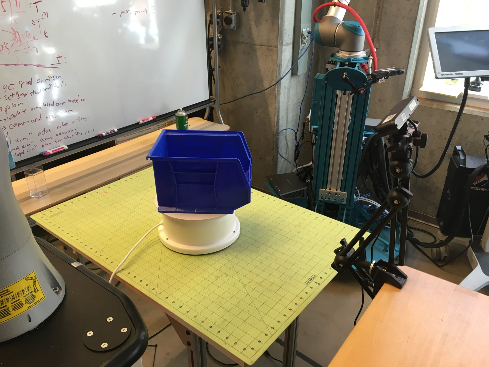

# object_on_table_segmenter (BETA)

Authors:
Felix Jonathan (fjonath1@jhu.edu)
Andrew Hundt (ahundt@jhu.ed)

object_on_table_segmenter is for saving and processing rgbd camera data such as from a kinect, primesense carmine or another sensor. It is used for:

 - Collecting object datasets, particularly when image segmentation is needed
 - Defining where objects should be considered valid or invalid in a 3D scene
 - Finding and save the surface of a table on which a robot is sitting
 - Saving out point clouds in .pcd format from an rgbd camera

## How it works

This ros package will perform plane segmentation and find the biggest plane, such as a table surface, found on the input point cloud to be used as a table convex hull. This table convex hull will be used in pcl ExtractPolygonalPrismData to extract objects above the table.

The convex hull is essentially extruded to make a prism that has the bottom surface located at minAboveTable and upper surface at maxAboveTable. All points inside of the prism will be extracted as objects above the table

While it doesn’t assume that the surface above the table is free of objects, having no objects above the plane helps the algorithm to get the proper biggest plane in the scene.

If the operating surface has vertical sides, such as with a large bin the algorithm should work just fine as long as the bottom surface of the bin has more points than the sides.

We've used this algorithm successfully on:

 - flat table surfaces
 - tables with a large plate on them
 - in a large plastic bin with dimensions of about 1.5m x 1m x 30cm.

A pcd can be saved which contains the convex hull of the table. 
So if we use loadTable, it will just load the saved pcd as the convex hull to segment the objects on table. 
Otherwise. It will try to get the table convex hull first before segmenting the objects.

## Prerequisites

To run this code you need:
  - Some point cloud2 publisher
  - ROS
  - PCL 1.7

## Executing

How to run the code:

```
roslaunch object_on_table_segmenter object_on_table_segmenter.launch
```

### Roslaunch Parameters
It is possible to pass some arguments to set the directory data, point cloud input, etc.


#### Object on table segmentation parameters
| Parameter Name | Explanation | Default |
|------------------------|-------------------------------------------------------------------------------------------------------------------------------------------------------------------------------------------------------------------------------------------------------------------------------------------------------|---------------------------------|
| object | The name of the object | cloud_cluster |
| save_directory | The directory where the resulting object on table segmentation will be saved | .../result/(object) |
| ground_truth_directory | The location where the segmented point cloud will be saved | (save_directory)/ground_truth |
| original_directory | The location where the raw input point cloud will be saved | (save_directory)/original |
| pcl_in | Input point cloud topic for the object on table segmentation | /camera/depth_registered/points |
| save_index | Starting index for point cloud | 0 |
| environment_only | Will just save everything in the point cloud without doing any object point cloud segmentation | false |
| time_step | Auto capture time step in seconds | 0.5 |
| num_to_capture | Number of frames captured in auto_capture before stopping | 200 |
| do_cluster | Do clusterization of point cloud after segmenting the objects above,table. Set this to false if the number of object above the table is just one object. If you have multiple of the same object type in the scene that are easily separable, you can cluster them into individual point cloud files. | true |
| auto_capture | Automatically periodically capture the object after the table point cloud is known (for use with turntables or ongoing motion) | true |

#### Table segmentation parameters
| Parameter Name           | Explanation                                                                                                                                                | Default            |
|--------------------------|------------------------------------------------------------------------------------------------------------------------------------------------------------|--------------------|
| load_table               | Load the table.pcd located in the data folder for convex hull                                                                                              | false              |
| update_table             | Update the table data located in the data folder                                                                                                           | true               |
| load_table_path          | Where the table.pcd located                                                                                                                                | .../data/table.pcd |
| table_tf                 | Frame that marks the table surface center. An example of this frame would be the TF frame of an AR tag you have placed on the table.                       | ar_marker_0        |
| use_tf_surface           | Use xy-plane of the table_tf frame as the table surface. If false, algorithm will try to find the biggest plane around the surface to get the convex hull. | false              |
| table_distance_threshold | PCL Plane segmentation distance threshold                                                                                                                  | 0.02               |
| table_angular_threshold  | PCL Plane segmentation angular threshold                                                                                                                   | 2                  |
| table_minimal_inliers    | PCL Plane segmentation minimal inliers                                                                                                                     | 7500               |
| use_rosbag               | Data collection is done on rosbag. Setting this to true should fix the TF frame failed to be found when using rosbag.                                      | false              |
| above_table_min          | Min distance from the table                                                                                                                                | 0.02               |
| above_table_max          | Max distance from the table                                                                                                                                | 0.5                |
| plane_seg_viewer         | Enable visualization of the box filtered cloud and the plane segmentation result                                                                           | false              |


## Examples

We use aruco markers that are 90mm across the black part 100mm total width on white outline.

Before starting make sure your sensor has a full and accurate view of the target region free of clutter.


```
roslaunch object_on_table_segmenter object_on_table_segmenter.launch tableTF:=ar_marker_2 use_tf_surface:=true above_table_min:=0.01 object:=blue_bin load_table:=true num_to_capture:=200
```

1. Here on the first run you put the marker on the table/turntable.



2. press 's' to get the pose of the marker, this is saved to disk
3. remove the marker, place your detection object on the table where the marker was



4. press 's' again to begin collecting data

```
roslaunch object_on_table_segmenter object_on_table_segmenter.launch object:=link_vert table_tf:=ar_marker_2 load_table:=false num_to_capture:=200
roslaunch object_on_table_segmenter object_on_table_segmenter.launch object:=link_horizontal table_tf:=ar_marker_2 load_table:=false num_to_capture:=200
```

Results will be placed in the local directory with the following structure

```
~/catkin_ws/src/costar_stack/costar_tools/object_on_table_segmenter
├── data
├── launch
├── link_uniform
├── node_uniform
├── original
├── res
├── result
│   ├── red_bin
│   │   ├── ground_truth
│   │   └── original
│   ├── blue_bin
│   │   ├── ground_truth
│   │   └── original
│   └── red_link
│       ├── ground_truth
│       └── original
├── result_vert_01
├── sander
│   └── original
└── src

```

original will contain the full source pcd (pcl point cloud format) files.
ground_truth will contain only segmented object data.

Files are written as follows:
```
<date>_<name>_<entry#>_ground_truth.pcd
2016_04_12_11_51_30_blue_bin_400_ground_truth.pcd

<date>_<name>_<entry#>_original.pcd
2016_04_12_11_51_30_blue_bin_400_original.pcd
```

If clustering is enabled each ground truth may have multiple entries. For example,
if you want to collect separate data for multiple objects on the table simultaneously.
Then the ground truth format will be:

```
<date>_<name>_<entry#>_cluster_<cluster#>_ground_truth.pcd
2016_04_12_11_51_30_blue_bin_400_ground_truth.pcd
```

#### Verify your data

Be sure to verify your data and make sure no incorrect data is present!

`pcl viewer path/to/file.pcd`

You can load everything at once to make your life easier and check for outliers:

`pcl viewer path/to/folder/with/pcds/*`


#### image extraction and segmentation

You can run `pcl_pcd2png` to convert your pcds into images

You can run `pcd2png_segment_gt.cpp` to perform semantic segmentation of your ground truth data and your image data.
